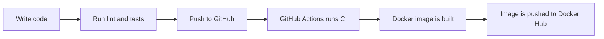

# Simple GitHub Action Project

A small but complete DevOps learning project: Node.js API, automated tests, linting, Docker image build, and GitHub Actions CI/CD that can publish to Docker Hub.

> [!TIP]
> If you are new to DevOps, read the files in order. Each document builds on the previous one, like a guided lab.

## Project at a Glance

| Layer | What This Project Uses | Why It Matters |
| --- | --- | --- |
| Application | Express API | Gives us real code to build and test |
| Quality checks | ESLint, Jest, Supertest | Catches problems before deployment |
| Container | Docker | Packages the app so it can run anywhere |
| Automation | GitHub Actions | Runs checks and builds automatically |
| Registry | Docker Hub | Stores the final Docker image |

## The Learning Route

Start here:

| Step | Guide | What You Will Learn |
| --- | --- | --- |
| 00 | [Project Overview](docs/00-project-overview.md) | What the project does and how the pieces connect |
| 01 | [Prerequisites](docs/01-prerequisites.md) | Tools and accounts you need before starting |
| 02 | [Create From Scratch](docs/02-create-project-from-scratch.md) | Build the same project step by step |
| 03 | [Application Code](docs/03-application-code-walkthrough.md) | Understand the Express API line by line |
| 04 | [Testing and Linting](docs/04-testing-and-linting.md) | Validate code before pushing |
| 05 | [Docker Guide](docs/05-docker-guide.md) | Build and run the app as a container |
| 06 | [GitHub Actions CI/CD](docs/06-github-actions-cicd.md) | Automate lint, test, build, and push |
| 07 | [Docker Hub Secrets](docs/07-docker-hub-secrets.md) | Store credentials safely in GitHub |
| 08 | [Troubleshooting](docs/08-troubleshooting.md) | Fix common local and CI issues |
| 09 | [Final Checklist](docs/09-final-checklist.md) | Confirm the full project works end to end |

## Quick Start

Run these commands from the project root:

```bash
npm ci
npm run lint
npm test
npm start
```

Then open another terminal:

```bash
curl http://localhost:3000/health
curl http://localhost:3000/students
```

Expected result: the first command returns `{ "status": "ok" }`, and the second returns a small student list.

## End-to-End Flow



