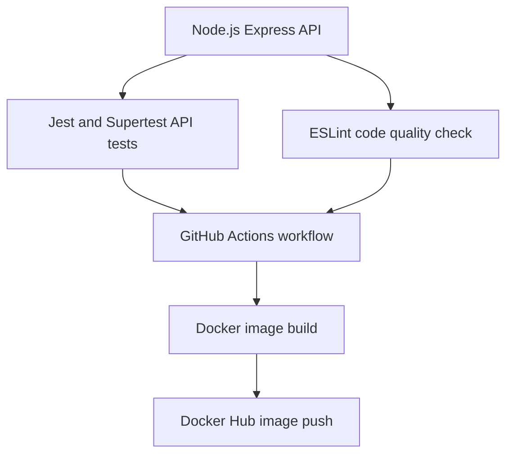

# Project Overview

This project is a compact DevOps pipeline you can understand from top to bottom. It starts with a tiny Express API and ends with an automated Docker image push to Docker Hub.

## What You Are Building

You are building a real, working delivery flow:



> [!NOTE]
> The app is intentionally small. That is useful for learning because you can focus on the DevOps workflow instead of fighting application complexity.

## Technology Stack

| Area | Tool | Role in This Project |
| --- | --- | --- |
| Runtime | Node.js 20 | Runs the JavaScript application |
| Web framework | Express | Creates the API routes |
| Testing | Jest, Supertest | Verifies the API behavior |
| Linting | ESLint | Enforces basic code quality rules |
| Containerization | Docker | Packages the app into an image |
| CI/CD | GitHub Actions | Automates checks and image publishing |
| Registry | Docker Hub | Stores the pushed Docker image |

## Repository Map

```text
simple-github-action-project/
  .github/
    workflows/
      ci.yml
  docs/
  src/
    app.js
  test/
    app.test.js
  .dockerignore
  .gitignore
  Dockerfile
  eslint.config.js
  package-lock.json
  package.json
  README.md
```

## API Surface

The API exposes two endpoints:

| Method | Endpoint | Purpose |
| --- | --- | --- |
| GET | `/health` | Confirms the API is running |
| GET | `/students` | Returns a sample student list |

Health check response:

```json
{
  "status": "ok"
}
```

Student list response:

```json
[
  {
    "id": 1,
    "name": "Ravi",
    "dept": "CSE"
  },
  {
    "id": 2,
    "name": "Anu",
    "dept": "ECE"
  }
]
```

## CI/CD Behavior

The workflow lives here:

```text
.github/workflows/ci.yml
```

It reacts to two common GitHub events:

| Event | What Happens |
| --- | --- |
| Pull request to `main` | Install dependencies, lint, test, prepare Docker builder |
| Push to `main` | Do all checks, log in to Docker Hub, build image, push image |

## Mental Model

Think of the project as three layers:

| Layer | Question It Answers |
| --- | --- |
| App layer | Does the API work? |
| Quality layer | Can tests and lint prove it is safe to ship? |
| Delivery layer | Can CI/CD package and publish it automatically? |

When all three layers pass, you have an end-to-end DevOps workflow.
