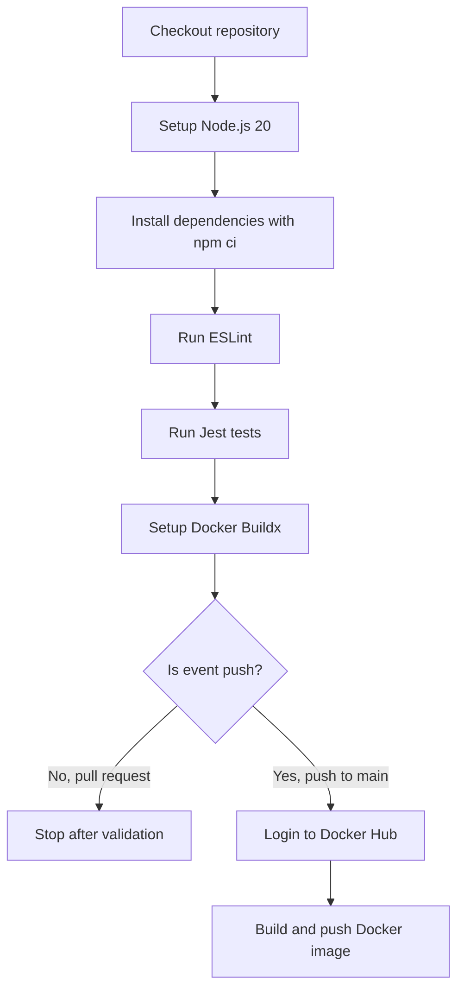

# GitHub Actions CI/CD

GitHub Actions is the automation engine for this project. Once code reaches GitHub, the workflow checks it and, on `main`, publishes a Docker image.

## What CI/CD Means Here

| Term | In This Project |
| --- | --- |
| CI | Install dependencies, run lint, run tests |
| CD | Build and push the Docker image to Docker Hub |

> [!IMPORTANT]
> Pull requests validate the code. Pushes to `main` publish the image.

## Workflow File Location

```text
.github/workflows/ci.yml
```

## Complete Workflow

```yaml
name: Node.js CI + Docker Hub

on:
  push:
    branches: ["main"]
  pull_request:
    branches: ["main"]

jobs:
  test-lint-build-push:
    runs-on: ubuntu-latest

    steps:
      - name: Checkout repository
        uses: actions/checkout@v4

      - name: Setup Node.js
        uses: actions/setup-node@v4
        with:
          node-version: 20
          cache: npm

      - name: Install dependencies
        run: npm ci

      - name: Run lint
        run: npm run lint

      - name: Run tests
        run: npm test

      - name: Set up Docker Buildx
        uses: docker/setup-buildx-action@v3

      - name: Login to Docker Hub
        if: github.event_name == 'push'
        uses: docker/login-action@v3
        with:
          username: ${{ secrets.DOCKERHUB_USERNAME }}
          password: ${{ secrets.DOCKERHUB_TOKEN }}

      - name: Build and push Docker image
        if: github.event_name == 'push'
        uses: docker/build-push-action@v6
        with:
          context: .
          push: true
          tags: |
            ${{ secrets.DOCKERHUB_USERNAME }}/student-api:latest
            ${{ secrets.DOCKERHUB_USERNAME }}/student-api:${{ github.sha }}
```

## When the Workflow Runs

| GitHub Event | Branch | What Happens |
| --- | --- | --- |
| Pull request | `main` | Lint, tests, Docker Buildx setup |
| Push | `main` | Lint, tests, Docker login, image build, image push |

## Workflow Map



## Job Name

```yaml
test-lint-build-push:
```

This is the job that runs all CI/CD steps.

## Runner

```yaml
runs-on: ubuntu-latest
```

GitHub provides a temporary Ubuntu machine for the workflow run.

## Step 1: Checkout Repository

```yaml
- name: Checkout repository
  uses: actions/checkout@v4
```

This downloads your repository code into the GitHub Actions runner.

## Step 2: Setup Node.js

```yaml
- name: Setup Node.js
  uses: actions/setup-node@v4
  with:
    node-version: 20
    cache: npm
```

This installs Node.js 20 and enables npm dependency caching.

## Step 3: Install Dependencies

```yaml
- name: Install dependencies
  run: npm ci
```

`npm ci` installs dependencies exactly from `package-lock.json`. This is preferred in CI because it is reproducible.

## Step 4: Run Lint

```yaml
- name: Run lint
  run: npm run lint
```

This fails the workflow if code style rules are broken.

## Step 5: Run Tests

```yaml
- name: Run tests
  run: npm test
```

This fails the workflow if API tests fail.

## Step 6: Set Up Docker Buildx

```yaml
- name: Set up Docker Buildx
  uses: docker/setup-buildx-action@v3
```

Buildx is Docker's extended builder. It is commonly used in GitHub Actions for building container images.

## Step 7: Login to Docker Hub

```yaml
- name: Login to Docker Hub
  if: github.event_name == 'push'
  uses: docker/login-action@v3
```

This step runs only for push events.

It does not run for pull requests because pull requests should not publish images.

## Step 8: Build and Push Docker Image

```yaml
- name: Build and push Docker image
  if: github.event_name == 'push'
  uses: docker/build-push-action@v6
```

This builds the Docker image and pushes it to Docker Hub.

The workflow creates two tags:

| Tag | Meaning |
| --- | --- |
| `latest` | Latest image from the `main` branch |
| `${{ github.sha }}` | Unique image tag based on the Git commit SHA |

The commit SHA tag is useful because it points to one exact version of the code.

## How to View Workflow Runs

1. Open the GitHub repository.
2. Click the `Actions` tab.
3. Click `Node.js CI + Docker Hub`.
4. Open the latest run.
5. Expand each step to see logs.

## Common CI/CD Flow

```text
Create branch
Make code change
Run npm run lint and npm test locally
Push branch
Open pull request
GitHub Actions validates pull request
Merge into main
GitHub Actions builds and pushes Docker image
```

## What Success Looks Like

- The GitHub Actions run has a green check.
- The `Run lint` step passes.
- The `Run tests` step passes.
- On push to `main`, Docker Hub receives new image tags.
